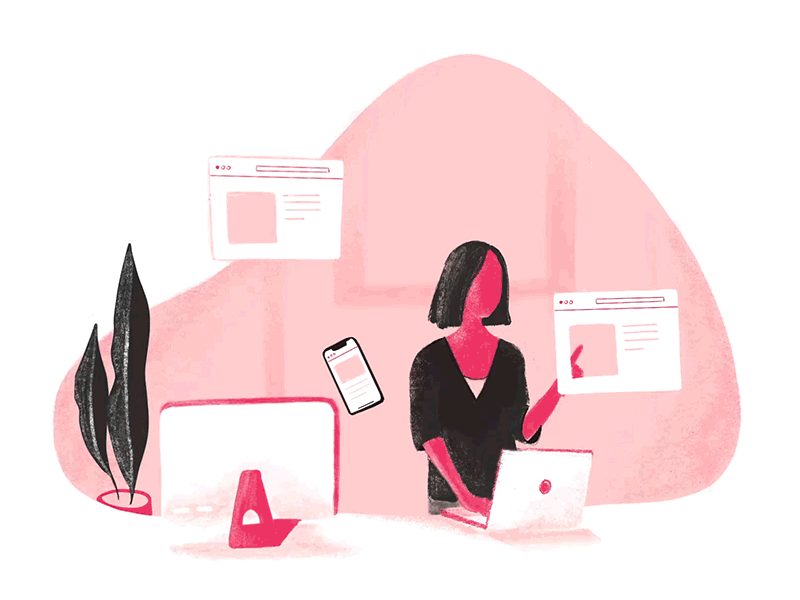

<h1 align="center">  
  
  𝑯𝒆𝒍𝒍𝒐, 𝒇𝒆𝒍𝒍𝒐𝒘 &lt;𝗽𝗿𝗼𝗴𝗿𝗮𝗺𝗺𝗲𝗿𝘀/&gt;!
    Ada Rachel here!</h1>
<h3 align="center">I am a Full-Stack Web Development Student at Microverse.org.</h3>

<!--   <a href="https://github.com/DenverCoder1/readme-typing-svg"> -->
    </a>

<h4>My name is Rachel, an aspiring Senior Full-Stack Web Developer. I am currently enrolled in the Web Development 2022-2023 course at Microverse.org, and I am making daily Github contributions and involved in building web applications and other projects everyday. I am love exploring and learning new programming languages and I am presently invested in building online Javascript games. I love this field and I am hoping to learn much more!</h4>

:pushpin: Full Name: **Adaobi Rachel Oyeoka**.
 :pushpin: Pronouns: **She**/ **Her** / **Hers**.
 :pushpin: I earned an **Advanced Diploma** in Software Engineering in 2020. Obtained from the [Intercom Programming and Manufacturing Company A.K.A. IPMC](https://www.ipmctraining.com/) College of Technology, Accra, Ghana.
 :pushpin: I’m currently learning **Full-Stack Web Development** At [Microverse](https://www.microverse.org/).
 :pushpin: I am looking for job opportunities, please send me an email at <a href="mailto:adarachelofficial@gmail.com">adarachelofficial@gmail.com</a>.
 :pushpin: Find my projects and contributions [here](https://github.com/adarachel?tab=repositories).
 :pushpin: Hobbies: Reading and writing book reviews, learning new things & meeting new people.

<h3 align="center">Connect with me:</h3>

  
    
    
  
 

---

### Skills 🛠️

 &nbsp;  &nbsp;  &nbsp;  &nbsp;  &nbsp;  &nbsp;   &nbsp;  &nbsp; 
&nbsp; 
&nbsp; 
&nbsp; 
&nbsp; 

---

## GitHub stats 🚀:

---

<em><b>Let's connect and collaborate! I reply all emails!</b> 😊 </em>
